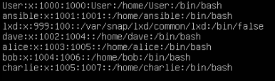
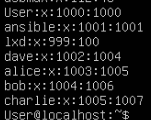
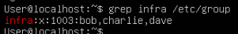
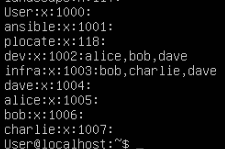
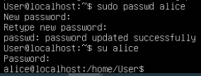
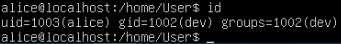
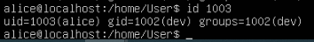
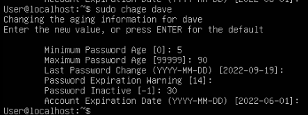

# Compte-rendu TP 3
*Mathilde Rubi*

## Exercice 1. Gestion des utilisateurs et des groupes

1. Pour créer deux groupes dev et infra avec la commande groupadd on fait :
```
sudo groupadd dev
sudo groupadd infra

```
2. Pour créer les 4 utilisateurs avec la commande useradd en demandant la création de leur dossier personnel on peut faire :
```
sudo useradd -m charlie --shell /bin/bash
sudo useradd -m bob --shell /bin/bash
sudo useradd -m dave --shell /bin/bash
sudo useradd -m alice --shell /bin/bash

```

Les utilisateurs sont présents dans le fichier /etc/passwd, ils ont donc bien été créés

3. Pour ajouter les utilisateurs dans les groupes créés on fait :
```
sudo usermod -a -G dev alice
sudo usermod -a -G dev bob
sudo usermod -a -G dev dave
sudo usermod -a -G infra bob
sudo usermod -a -G infra charlie
sudo usermod -a -G infra dave
```

Les utilisasteurs ont bien été ajoutés à des groupes.

4. Pour afficher les membres de infra on peut faire :
```
grep infra /etc/group

ou

cat /etc/group
```



5. Pour faire de dev le groupe propriétaire des répertoires /home/alice et /home/bob et de infra le groupe propriétaire de /home/charlie et /home/dave

```
sudo chgrp dev /home/alice
sudo chgrp dev /home/bob
sudo chgrp infra /home/charlie
sudo chgrp infra /home/dave
```

6. Pour remplacer le groupe primaire des utilisateurs en dev pour alice et bob et en infra pour charlie et dave, on exécute les commandes suivantes :

```
sudo usermod alice -g dev
sudo usermod bob -g dev
sudo usermod charlie -g infra
sudo usermod dave -g infra
```

7. On crée les répertoires avec les lignes :
```
sudo mkdir/home/dev
sudo mkdir/home/infra
```
Ensuite, pour attribuer les droits sur ces dossiers, on fait :
```
#!/bin/bash

sudo chmod 775 /home/dev
sudo chmod 775 /home/infra
```

8. Pour que dans ces dossiers, seul le propriétaire d'un fichier ait le droit de renommer ou suprimer ce fichier, on ajoute un sticky bit, que l'on ajoute avec :
```
#!/bin/bash
chmod +t /home/dev
chmod +t /home/infra
```

9. On ne peut pas ouvrir une session en tant que alice car le compte alice ne possédant pas de password, le compte n'est pass actif.

10. Maintenant que le compte a été activé (avec la commande sudo passwd alice et en mot de passe alice), nous avons pu nous connecter avec son compte


11. On obtient l'uid et le gid de alice en tapant :
```
#!/bin/bash
id
```


12. Pour retrouver l'utilisateur dont l'uid est 1003 on exacute la commande id 1003



13. 

14.

15. La suppression d'alice du groupe infra ne fonctionne pas. Le groupe infra est le groupe primaire d'alice, elle ne peut pas se faire supprimer de son groupe primaire.

16. Pour modifier le compte de dave de sorte que : 
— il expire au 1
er juin 2021
— il faut changer de mot de passe avant 90 jours
— il faut attendre 5 jours pour modifier un mot de passe
— l’utilisateur est averti 14 jours avant l’expiration de son mot de passe
— le compte sera bloqué 30 jours après expiration du mot de passe
on fait :

```
#!/bin/bash

sudo chage dave

```


17. L'interpréteur de commande de l'utilisateur root se trouve avec 
```
#!/bin/bash

getent passwd root
```

18. L'utilisateur nobody existe pour lancer des daemons pour, en cas d'utilisation par un utilisateur malveillant, limiter les dégats.

19. Par défaut, la commande sudo conserve le mot de passe en mémoire pendant 15 minutes. On peut forcer sudo à oublier notre mot de passe avec la commande sudo -k

## Exercice 2. Gestion des permissions

1. Les droits sur le dossier test sont visibles avec la commande ls -l ou ll. Le propriétaire et le groupe ont tous les droits sur le dossier test, les autres ont uniquement le droit de lecture et d'exécution. Pour le fichier fichier, le propriétaire et le groupe ont uniquement le droit de lecture et d'écriture, les autres ont uniquement le droit de lecture.
2. Avec la commande `chmod 000 ./test/fichier` on retire tous les droits à tout le monde sur le fichier fichier. Avec la commande nano ./test/fichier, on essaye de le modifier. Il n'est pas possible de le lire, rien n'apparait à l'écran, et un "Error reading ./test/fichier: Permission denied" est affiché à l'écran. En tant que root, avec la commande sudo nano ./test/fichier, on peut lire le fichier et le modifier. Un message est à l'écran "./test/fichier is meant to be read-only". En tant que root, toute action est permise.
3. Avec la commande chmod 300 ./test/fichier on peut se remettre les droits d'écriture et d'exécution. En exécutant la commande echo "echo Hello" > fichier , on constate qu'elle fonctionne, mais que l'ouverture en lecture du fichier n'est pas permise.
4. Il ne m'est pas possible d'exécuter le fichier. En l'affichant avec sudo cat ./test/fichier l'affichage fonctionne.
5. Avec `chmod 300 ~/test` on se retire les droits de lecture du répertoire. On ne peut pas lister le contenu du répertoire. On ne peut pas non plus afficher le contenu du fichier fichier. Les droits sur le répertoire se propagent sur son contenu.

6. `nano nouveau
mkdir sstest
chmod 500 ~/test/nouveau
chmod 500 ~/test/sstest`
Le fichier nouveau n'est pas modifiable après avoir retiré les droits en écriture. Après avoir rétabli le droit en écriture au répertoire test, le fichier nouveau n'est toujours pas modifiable. Il est cependant supprimable.

7. `chmod 600 ./test` retire le droit en exécution du dossier test. Il ne m'est plus possible de='entrer dans le répertoire. Lister le contenu, s'y déplacer n'est pas non plus possible.
8. En retirant les droits du répertoire dans le répertoire, il ne m'est pas possible non plus de créer un fichier, me déplacer dans le répertoire sstest. Les droits que l'on a sur le répertorie courant prévalent sur les droits des fichiers et dossiers à l'intérieur.
9. `chmod 750 ./test/fichier`
10. `umask 711`
11. `umask 755`
12. `umask 740`
13. - chmod u=rx,g=wx,o=r fic équivaut à chmod 534
- chmod uo+w,g-rx fic en sachant que les droits initiaux de fic sont r--r-x--- équivaut à chmod 602
- chmod 653 fic en sachant que les droits initiaux de fic sont 711 équivaut à chmod u-x, g+r, o+w fic
- chmod u+x,g=w,o-r fic en sachant que les droits initiaux de fic sont r--r-x--- équivaut à chmod 520 fic
